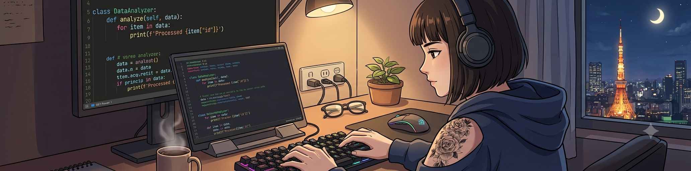
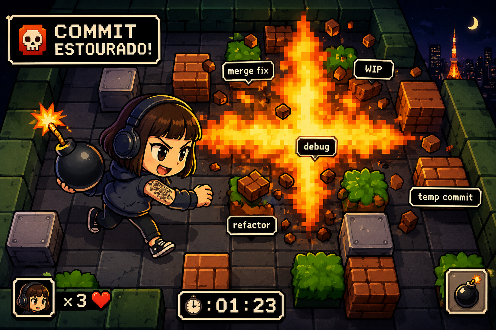

 

 

---

# 👩‍💻 Sobre Mim

Profissional em transição para a área de Tecnologia, unindo experiência em negócios, mercado financeiro e análise de resultados com Desenvolvimento Full Stack e Análise de Dados.

🎓 Desenvolvedora Full Stack

📊 Analista de Dados

🏦 Experiência no mercado financeiro

📈 Data Driven Mindset

🚀 Interesse em IA, Analytics, BI e Engenharia de Software

---

# 🎯 Objetivos Profissionais

- Desenvolvedora Full Stack Júnior
- Analista de Dados Júnior
- Business Intelligence
- Python Developer
- Ciência de Dados

---

# 💻 Tech Stack

### Linguagens

### Desenvolvimento

### Dados

---

# 🌟 Meu Diferencial

| Negócios | Dados | Tecnologia |
|-----------|-----------|-----------|
| Mercado Financeiro | SQL | Python |
| Relacionamento com Clientes | Power BI | JavaScript |
| Vendas Consultivas | Dashboards | Full Stack |
| Análise de Resultados | Analytics | Automação |

---

# 💣 Contribution Zone

### Bomberman Exploding Commits

---

### 👾 Pac-Man Eating Contributions

<picture>
  <source media="(prefers-color-scheme: dark)" srcset="https://raw.githubusercontent.com/abozanona/abozanona/output/pacman-contribution-graph-dark.svg">
  <source media="(prefers-color-scheme: light)" srcset="https://raw.githubusercontent.com/abozanona/abozanona/output/pacman-contribution-graph.svg">
  
</picture>

---

# 📫 Contato

