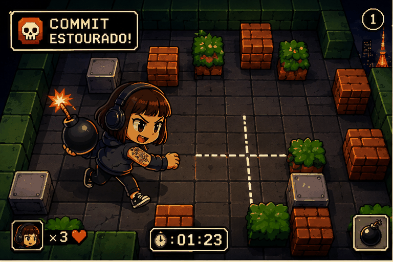

 

 

---

# 👩‍💻 Sobre Mim

💻 Desenvolvedora Full Stack formada e futura Cientista de Dados em construção.

Tenho mais de 10 anos de experiência no setor financeiro, atuando com análise de resultados, processos corporativos, sistemas de gestão e suporte a decisões estratégicas. Minha trajetória em instituições como Itaú Unibanco e Banco Mercantil do Brasil desenvolveu uma forte visão de negócios que hoje complemento com competências em tecnologia e dados.

🚀 Tecnologias: Python, SQL, JavaScript, HTML, CSS e Lógica de Programação.

📊 Interesses: Data Analytics, Business Intelligence, Ciência de Dados, Inteligência Artificial e Desenvolvimento Full Stack.

💡 Acredito no poder da tecnologia para transformar dados em decisões e processos em soluções. Meu objetivo é unir conhecimento de negócio, análise de dados e desenvolvimento de software para criar produtos e experiências que gerem valor real.

---

# 🎯 Objetivos Profissionais

- Desenvolvedora Full Stack Júnior
- Analista de Dados Júnior
- Business Intelligence
- Python Developer
- Ciência de Dados

---

# 💻 Tech Stack

### 💻 Linguagens

### 🗄️ Banco de Dados

### ⚙️ Ferramentas de Desenvolvimento

### 📊 Dados & BI

---
---

## 🚀 Minha Combinação de Competências

| 💼 Negócios | 📊 Dados | 💻 Tecnologia |
|------------|----------|---------------|
| +10 anos no Mercado Financeiro | SQL | Python |
| Vendas Consultivas | Power BI | JavaScript |
| Relacionamento com Clientes | Dashboards e KPIs | HTML & CSS |
| Gestão de Carteira e Resultados | Análise de Dados | Desenvolvimento Full Stack |
| Experiência do Cliente | Data Analytics | Automação |
| Visão Estratégica | Storytelling com Dados | Solução de Problemas |

---

# 💣 Contribution Zone

  

---

# 📫 Contato

